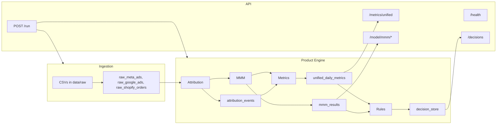

# HypeOn Product Engine — Architecture

## Scope

Product engine only: ingestion from CSVs in `data/raw/`, attribution (MTA + optional Markov), MMM (adstock, saturation, regression), unified metrics aggregation, rules engine, and decision store. Exposed via FastAPI. No frontend, no external connectors, no synthetic data.

## Data flow

```
CSVs in data/raw/
    → Ingest (upsert) → raw_meta_ads, raw_google_ads, raw_shopify_orders
    → Attribution (fractional / Markov) → attribution_events
    → MMM (adstock + saturation + regression) → mmm_results
    → Metrics (aggregate) → unified_daily_metrics
    → Rules (thresholds + MMM) → decision_store
    → API (GET /metrics/unified, /decisions, /model/mmm/*, POST /run)
```

## Sequence (high level)

1. **Ingest:** Read `meta_ads.csv`, `google_ads.csv`, `shopify_orders.csv` from `data/raw/`; upsert into raw tables.
2. **Attribution:** For each order in the date range, allocate revenue to channels by spend share (or optional Markov removal effect if session data exists). Write `attribution_events` with `run_id`.
3. **MMM:** Build daily spend matrix and revenue; apply adstock (half-life) and log saturation; fit OLS/Ridge; persist coefficients and R² to `mmm_results`.
4. **Metrics:** Aggregate spend and attributed revenue by (date, channel); compute ROAS, MER, CAC; upsert `unified_daily_metrics`.
5. **Rules:** Read `unified_daily_metrics`, `mmm_results`, `store_config`; apply scale_up/scale_down and reallocate rules; compute confidence from R² and recency; insert into `decision_store`.
6. **API:** `/health`, `/metrics/unified`, `/decisions`, `POST /run`, `/model/mmm/status`, `/model/mmm/results`.

## Product-grade extensions

- **Budget optimizer** (`GET /optimizer/budget?total_budget=S`): Reallocate total spend S across channels using greedy marginal ROAS (MMM response curve); respects saturation.
- **Decision simulator** (`POST /simulate`): Body `{ "meta_spend_change": 0.2, "google_spend_change": -0.1 }`; returns projected revenue delta for interactive what-if.
- **Attribution vs MMM report** (`GET /report/attribution-mmm-comparison`): Compares MTA-attributed share by channel vs MMM contribution share; flags instability when disagreement score exceeds threshold (e.g. 0.25).

## Diagram



## Tech stack

- Python 3.11+, FastAPI, SQLModel, Alembic, PostgreSQL
- pandas, numpy, scikit-learn, statsmodels for MMM/metrics
- pytest, ruff, mypy
- Docker & docker-compose (Postgres + API only)
